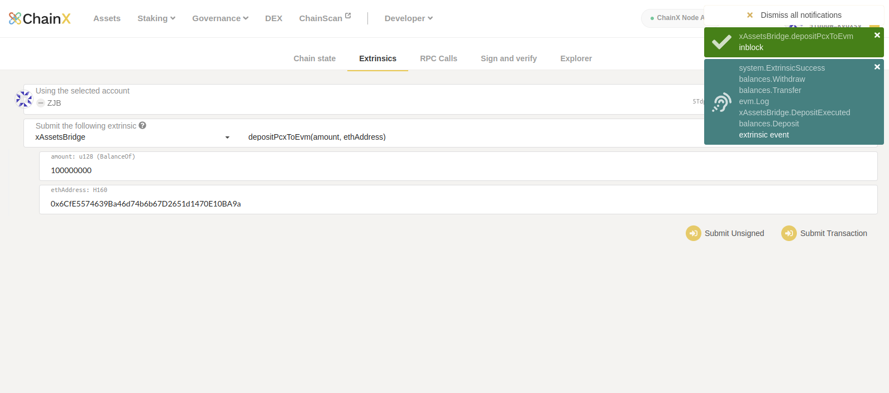
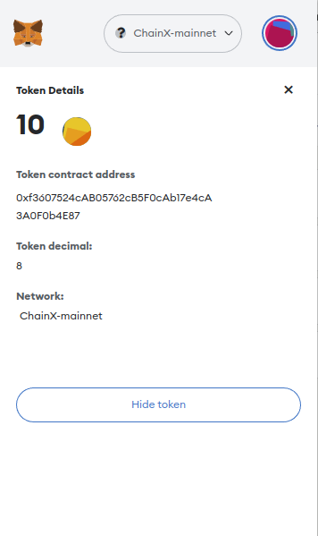
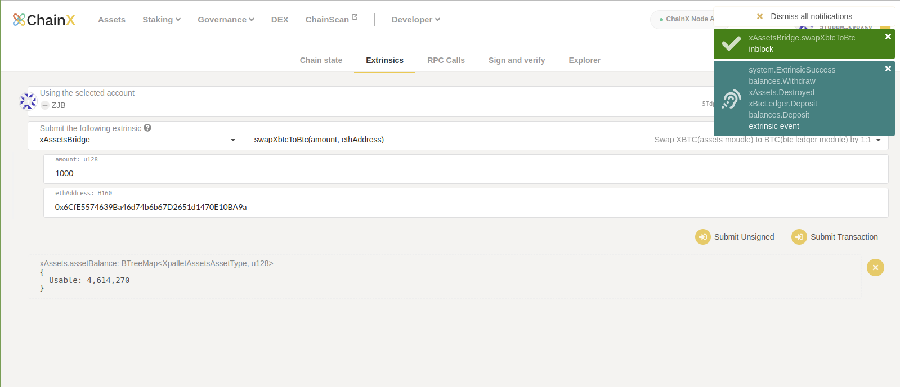
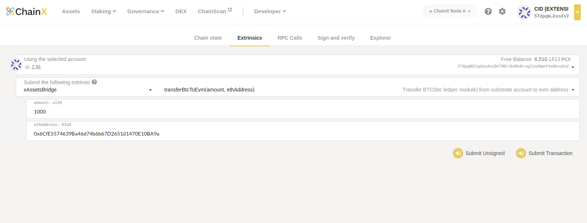

# ChainXBridge

Through ChainXBridge, assets in BEVM(formerly called `chainx-evm`) and Bitcoin can circulate freely

## 1. Deposit

### 1.1 BTC(bitcoin -> bevm)
TODO

### 1.2 BRC20(bitcoin -> bevm)
TODO

### 1.3 PCX(chainx -> bevm)
ChainX wallet: https://dapp.chainx.org/#/chainstate/extrinsics

xAssetsBridge -> depositPcxToEvm

100000000 means 1 PCX

PCX erc20 address: `0xf3607524cAB05762cB5F0cAb17e4cA3A0F0b4E87`

metamask wallet

### 1.4 XBTC => BTC(chainx -> bevm)
ChainX wallet: https://dapp.chainx.org/#/chainstate/extrinsics

xAssetsBridge -> swapXbtcToBtc

1000 means 0.00001000 XBTC

### 1.5 BTC(chainx -> bevm)
ChainX wallet: https://dapp.chainx.org/#/chainstate/extrinsics

xAssetsBridge -> transferBtcToEvm

1000 means 0.00001000 BTC

## 2. Withdraw

### 2.1 BTC(bevm -> bitcoin)
TODO

### 2.2 BRC20(bevm -> bitcoin)
TODO

### 2.3 PCX(bevm -> chainx)
TODO