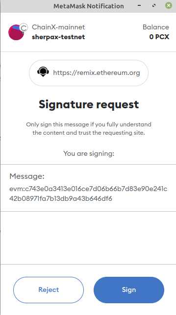

# [deprecated] XBTC in ChainX-EVM 

## 1. XBTC
ChainX is the community-run layer2 network of bitcoin, and your portal into the world of Bitcoin ecosysterm.
Bitcoin on Chain is XBTC.

## 2. ChainX-EVM
Fork from [frontier](https://github.com/paritytech/frontier).

As we all know, ChainX decimals=8, Metamask supports evm chain with decimals=18 by default.
In order to be compatible with Metamask, [chainx-frontier](https://github.com/chainx-org/frontier/tree/polkadot-v0.9.18) has done the following for Native Currency Balance

- (1) `wasm -> evm` (get_Balance): expand 10^10
- (2) `evm -> wasm` (calc gas fee): shrink 10^10

## 3. ChainX and EVM address

More details in [Substrate & EVM address on ChainX](./substrate_and_evm_address_on_chainx.md)

## 4. Assets-Bridge
`xpallet-assets-bridge` will interact in such a way: 
- Bind EVM address and ChainX account
- Bind WASM assets and Erc20 tokens
- Deposit and withdraw fungible assets between WASM and EVM

More details in [xpallet-assets-bridge](../xpallets/assets-bridge/README.md)

## 5. AssetsBridgeErc20

[AssetsBridgeErc20](../contracts/) is a set of evm smart contracts that are Erc20 contracts adapted to pallet-assets-bridge

## 6. Metamask

```txt
Network name: ChainX
RPC URL: https://mainnet.chainx.org/rpc
Chain ID: 1501
Currency symbol: PCX
Block explorer URL (Optional): https://evm.chainx.org/
```

XBTC in ChainX-EVM
```text
contract address: 0xc91a8e500E814990b06BDb4fC10745124fdBE748
decimals: 8
symnol: XBTC
```

## 7. Bind XBTC assets(in wasm) and Erc20 token(in evm)

This operator is the admin of assets-bridge.

In the production environment, the admin of assets-bridge must audits whether the erc20 contract
implements `IAssetsBridge` interface and whether it has the `AssetsBridgeAdmin` modifier.

## 8. Interaction of XBTC with wasm and evm

This operator is the user of XBTC.

### 8.1 Bind EVM address and ChainX account with 1 pcx

[Eth Signed Data Format](../xpallets/assets-bridge/README.md)

```txt
"evm:" + substrate_pubkey_hex_without_0x
```

#### 8.1.1 Get the public key hex string
account address: `5U9J4qgVjCnEA5eDYWCURJBfLrPxqo71SuLuAQQp8g4TtoSq`

Use [this online tool](https://polkadot.subscan.io/tools/format_transform?input=5U9J4qgVjCnEA5eDYWCURJBfLrPxqo71SuLuAQQp8g4TtoSq&type=Public%20Key)
can get its public key: `0xc743e0a3413e016ce7d06b66b7d83e90e241c42b08971fa7b13db9a43b646df6`

To sign data is `evm:c743e0a3413e016ce7d06b66b7d83e90e241c42b08971fa7b13db9a43b646df6`

#### 8.1.2 Get signature by Remix sign tool

Open [remix](https://remix.ethereum.org/) connect to metamask(select you evm account, here is `0x6CfE5574639Ba46d74b6b67D2651d1470E10BA9a`)

Use remix sign tool, to sign `evm:c743e0a3413e016ce7d06b66b7d83e90e241c42b08971fa7b13db9a43b646df6`





Get the signature:
```txt
0xf069e977f37863d599e853e7c9ee35953079af42ba5b827d7c1c957c53a57adb2a8f2d86e2f49495baf35f34053def92ef879bc32b87acbea8832d791495a91a1b
```

#### 8.1.3 Call xassetsBridge->claimAccount

This call will be reserved 1 PCX(when you call `xassetsBridge->dissolve`, this 1 PCX will be unreserved)


The evm address `0x6CfE5574639Ba46d74b6b67D2651d1470E10BA9a` has been bound to ChainX address `5U9J4qgVjCnEA5eDYWCURJBfLrPxqo71SuLuAQQp8g4TtoSq`.

### 8.2 Teleport PCX as evm gas

Call `xassetsBridge->teleport`

deposit `200000000` (means 2 PCX, decimals=8)


The transferable PCX is `2`, because `EXISTENTIAL_DEPOSIT = 0` on ChainX.

For more details, By [this tool](../scripts/convert-evm-address/src/evm_to_chainx.js),
we can get the evm address's proxy substrate account.

```bash
node src/evm_to_chainx.js 0x6CfE5574639Ba46d74b6b67D2651d1470E10BA9a
evm    address:  0x6CfE5574639Ba46d74b6b67D2651d1470E10BA9a
chainx account:  5UKCmTuj5V4wmGnmZYm6RSDbT2mqwf2FUMTJy7phjwmwE51H
```


The balance is indeed `2` PCX.

### 8.3 Deposit XBTC from wasm to evm

Deposit `100000` (means 0.001 XBTC, decimals = 8) from wasm to evm


### 8.4 Withdraw XBTC from evm to wasm

Withdraw `10000` (means 0.0001, decimals = 8) from evm to wasm


`0.0009 XBTC` is in evm, `0.0001 XBTC` is in wasm.

### 8.5 transfer XBTC in evm


See in [chainx-evm explorer](https://evm.chainx.org/)


## 9. Advance: Interaction with XBTC erc20 contract

### 9.1 Connect Remix

Run [remixd](https://www.npmjs.com/package/@remix-project/remixd) to access local [contracts](../contracts)

```bash
cd ChainX
bash scripts/remix.sh
```


### 9.2 Compile AssetsBridgeErc20_OnlyAdmin.sol

Choose `AssetsBridgeErc20_OnlyAdmin.sol` to compile


XBTC contract address is `0xc91a8e500E814990b06BDb4fC10745124fdBE748`

`ENVIRONMENT` select `Injected Provider - MetaMask`

`CONTRACT(Compiled by Remix)` select `AssetBridgeErc20 - AssetsBridgeErc20_OnlyAdmin.sol`

`At Address` fill in `0xc91a8e500E814990b06BDb4fC10745124fdBE748`


Current XBTC in evm total supply is `0.00091000`(decimals=8)

When someone withdraw XBTC from evm to wasm, the total supply will decrease.

### 9.3 XBTC ABI

```json
[
    {
        "inputs": [
            {
                "internalType": "string",
                "name": "name_",
                "type": "string"
            },
            {
                "internalType": "string",
                "name": "symbol_",
                "type": "string"
            },
            {
                "internalType": "uint8",
                "name": "decimals_",
                "type": "uint8"
            }
        ],
        "stateMutability": "nonpayable",
        "type": "constructor"
    },
    {
        "anonymous": false,
        "inputs": [
            {
                "indexed": true,
                "internalType": "address",
                "name": "owner",
                "type": "address"
            },
            {
                "indexed": true,
                "internalType": "address",
                "name": "spender",
                "type": "address"
            },
            {
                "indexed": false,
                "internalType": "uint256",
                "name": "value",
                "type": "uint256"
            }
        ],
        "name": "Approval",
        "type": "event"
    },
    {
        "anonymous": false,
        "inputs": [
            {
                "indexed": true,
                "internalType": "address",
                "name": "previousOwner",
                "type": "address"
            },
            {
                "indexed": true,
                "internalType": "address",
                "name": "newOwner",
                "type": "address"
            }
        ],
        "name": "OwnershipTransferred",
        "type": "event"
    },
    {
        "anonymous": false,
        "inputs": [
            {
                "indexed": false,
                "internalType": "address",
                "name": "account",
                "type": "address"
            }
        ],
        "name": "Paused",
        "type": "event"
    },
    {
        "anonymous": false,
        "inputs": [
            {
                "indexed": true,
                "internalType": "address",
                "name": "from",
                "type": "address"
            },
            {
                "indexed": true,
                "internalType": "address",
                "name": "to",
                "type": "address"
            },
            {
                "indexed": false,
                "internalType": "uint256",
                "name": "value",
                "type": "uint256"
            }
        ],
        "name": "Transfer",
        "type": "event"
    },
    {
        "anonymous": false,
        "inputs": [
            {
                "indexed": false,
                "internalType": "address",
                "name": "account",
                "type": "address"
            }
        ],
        "name": "Unpaused",
        "type": "event"
    },
    {
        "inputs": [],
        "name": "admin",
        "outputs": [
            {
                "internalType": "address",
                "name": "",
                "type": "address"
            }
        ],
        "stateMutability": "view",
        "type": "function"
    },
    {
        "inputs": [
            {
                "internalType": "address",
                "name": "owner",
                "type": "address"
            },
            {
                "internalType": "address",
                "name": "spender",
                "type": "address"
            }
        ],
        "name": "allowance",
        "outputs": [
            {
                "internalType": "uint256",
                "name": "",
                "type": "uint256"
            }
        ],
        "stateMutability": "view",
        "type": "function"
    },
    {
        "inputs": [
            {
                "internalType": "address",
                "name": "spender",
                "type": "address"
            },
            {
                "internalType": "uint256",
                "name": "amount",
                "type": "uint256"
            }
        ],
        "name": "approve",
        "outputs": [
            {
                "internalType": "bool",
                "name": "",
                "type": "bool"
            }
        ],
        "stateMutability": "nonpayable",
        "type": "function"
    },
    {
        "inputs": [
            {
                "internalType": "address",
                "name": "account",
                "type": "address"
            }
        ],
        "name": "balanceOf",
        "outputs": [
            {
                "internalType": "uint256",
                "name": "",
                "type": "uint256"
            }
        ],
        "stateMutability": "view",
        "type": "function"
    },
    {
        "inputs": [
            {
                "internalType": "address",
                "name": "account",
                "type": "address"
            },
            {
                "internalType": "uint256",
                "name": "amount",
                "type": "uint256"
            }
        ],
        "name": "burn_from",
        "outputs": [
            {
                "internalType": "bool",
                "name": "",
                "type": "bool"
            }
        ],
        "stateMutability": "nonpayable",
        "type": "function"
    },
    {
        "inputs": [],
        "name": "decimals",
        "outputs": [
            {
                "internalType": "uint8",
                "name": "",
                "type": "uint8"
            }
        ],
        "stateMutability": "view",
        "type": "function"
    },
    {
        "inputs": [
            {
                "internalType": "address",
                "name": "spender",
                "type": "address"
            },
            {
                "internalType": "uint256",
                "name": "subtractedValue",
                "type": "uint256"
            }
        ],
        "name": "decreaseAllowance",
        "outputs": [
            {
                "internalType": "bool",
                "name": "",
                "type": "bool"
            }
        ],
        "stateMutability": "nonpayable",
        "type": "function"
    },
    {
        "inputs": [
            {
                "internalType": "address",
                "name": "spender",
                "type": "address"
            },
            {
                "internalType": "uint256",
                "name": "addedValue",
                "type": "uint256"
            }
        ],
        "name": "increaseAllowance",
        "outputs": [
            {
                "internalType": "bool",
                "name": "",
                "type": "bool"
            }
        ],
        "stateMutability": "nonpayable",
        "type": "function"
    },
    {
        "inputs": [
            {
                "internalType": "address",
                "name": "account",
                "type": "address"
            },
            {
                "internalType": "uint256",
                "name": "amount",
                "type": "uint256"
            }
        ],
        "name": "mint_into",
        "outputs": [
            {
                "internalType": "bool",
                "name": "",
                "type": "bool"
            }
        ],
        "stateMutability": "nonpayable",
        "type": "function"
    },
    {
        "inputs": [],
        "name": "name",
        "outputs": [
            {
                "internalType": "string",
                "name": "",
                "type": "string"
            }
        ],
        "stateMutability": "view",
        "type": "function"
    },
    {
        "inputs": [],
        "name": "owner",
        "outputs": [
            {
                "internalType": "address",
                "name": "",
                "type": "address"
            }
        ],
        "stateMutability": "view",
        "type": "function"
    },
    {
        "inputs": [],
        "name": "pause",
        "outputs": [],
        "stateMutability": "nonpayable",
        "type": "function"
    },
    {
        "inputs": [],
        "name": "paused",
        "outputs": [
            {
                "internalType": "bool",
                "name": "",
                "type": "bool"
            }
        ],
        "stateMutability": "view",
        "type": "function"
    },
    {
        "inputs": [],
        "name": "renounceOwnership",
        "outputs": [],
        "stateMutability": "nonpayable",
        "type": "function"
    },
    {
        "inputs": [],
        "name": "symbol",
        "outputs": [
            {
                "internalType": "string",
                "name": "",
                "type": "string"
            }
        ],
        "stateMutability": "view",
        "type": "function"
    },
    {
        "inputs": [],
        "name": "totalSupply",
        "outputs": [
            {
                "internalType": "uint256",
                "name": "",
                "type": "uint256"
            }
        ],
        "stateMutability": "view",
        "type": "function"
    },
    {
        "inputs": [
            {
                "internalType": "address",
                "name": "recipient",
                "type": "address"
            },
            {
                "internalType": "uint256",
                "name": "amount",
                "type": "uint256"
            }
        ],
        "name": "transfer",
        "outputs": [
            {
                "internalType": "bool",
                "name": "",
                "type": "bool"
            }
        ],
        "stateMutability": "nonpayable",
        "type": "function"
    },
    {
        "inputs": [
            {
                "internalType": "address",
                "name": "sender",
                "type": "address"
            },
            {
                "internalType": "address",
                "name": "recipient",
                "type": "address"
            },
            {
                "internalType": "uint256",
                "name": "amount",
                "type": "uint256"
            }
        ],
        "name": "transferFrom",
        "outputs": [
            {
                "internalType": "bool",
                "name": "",
                "type": "bool"
            }
        ],
        "stateMutability": "nonpayable",
        "type": "function"
    },
    {
        "inputs": [
            {
                "internalType": "address",
                "name": "newOwner",
                "type": "address"
            }
        ],
        "name": "transferOwnership",
        "outputs": [],
        "stateMutability": "nonpayable",
        "type": "function"
    },
    {
        "inputs": [],
        "name": "unpause",
        "outputs": [],
        "stateMutability": "nonpayable",
        "type": "function"
    }
]
```